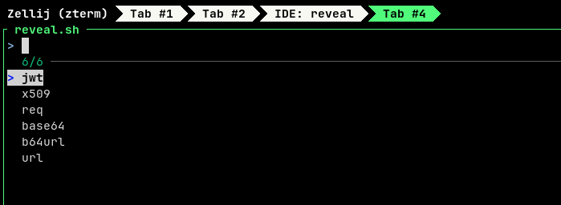
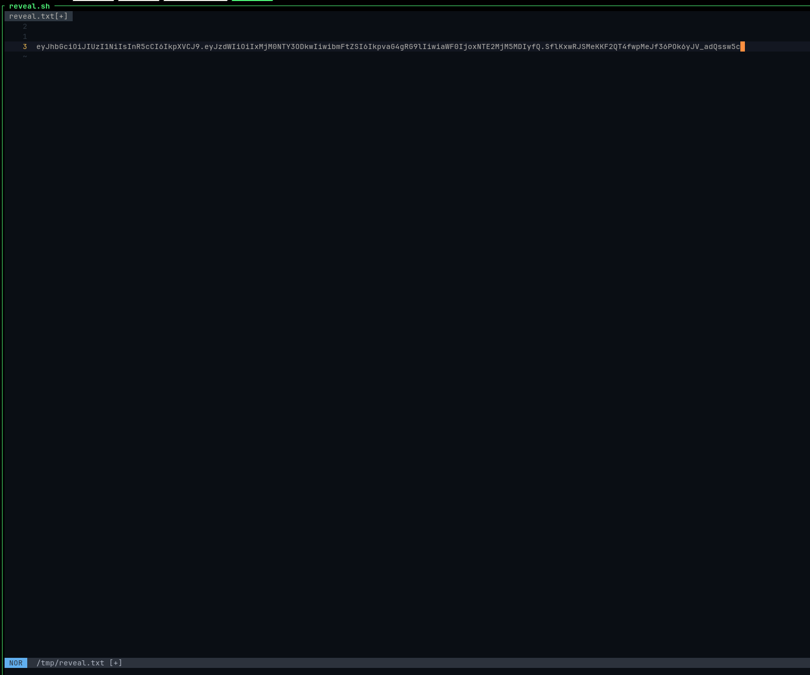
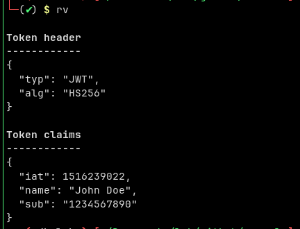

# Reveal: Decode jwt, X509 cert, base64, url from terminal

`reveal.sh` uses `fzf` to select a decode option (jwt x509 req base64 b64url url), then open a temp file via your `$EDITOR` where you can past your encoded data. After save and exit of your editor, it will print the decoded string.







## Install

Copy the [./reveal.sh](./reveal.sh) (`chmod +x` if needed). You can add `rv` to your shell rc file:

```
alias rv='/path/to/reveal.sh'
```


## Dependencies

* [fzf](https://github.com/junegunn/fzf)
* [jwt-cli](https://github.com/mike-engel/jwt-cli) 
* `openssl`
* `base64`


